# Data-Interleaver

## Introduction
In this project a stream interleaver is designed to combine two streams of data. Stream interleavers can be used in many different applications such as video and audio applications.
The equation that is used for the design is: P_f = a * P_0 + (1 - a) * P_1. P_0 and P_1 are the two input signals and a is the weight coefficient which determines the output waveform. The different implementations show different ways of designing this circuit in using: no dsp blocks, dsp blocks, different clock domains, and SRL components.

## Results
### Results for Direct Implementation
#### Here both no DSP blocks and using multiple DSP block implementations are shown.
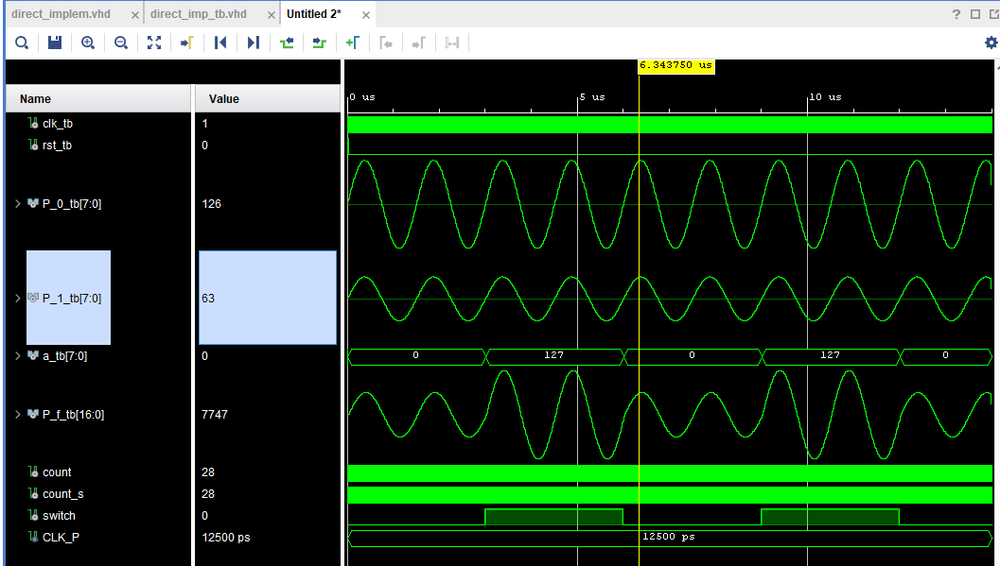  
### Implementation using no DSP  
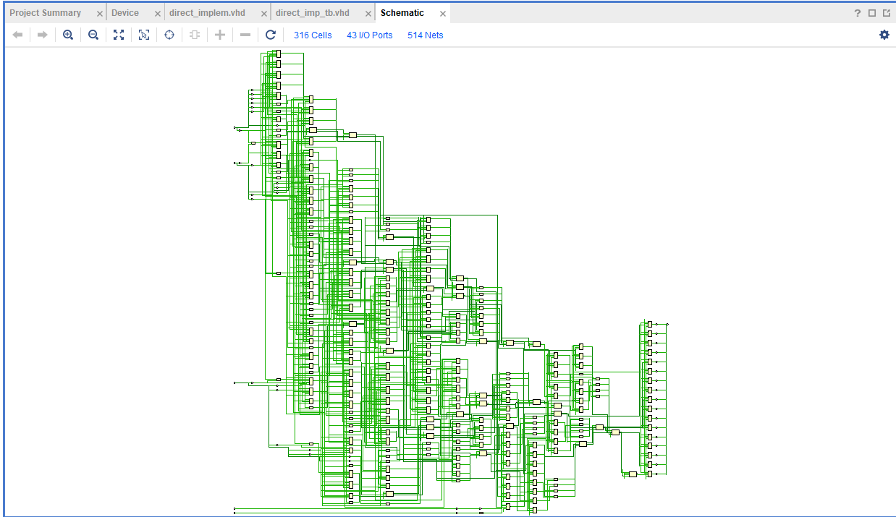  
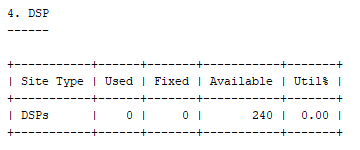  
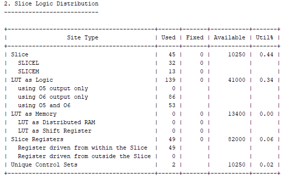  
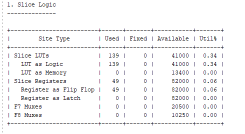  
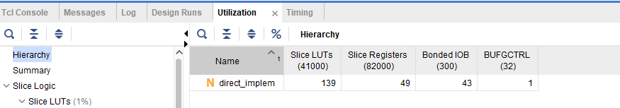  
### Implementation using DSP blocks  
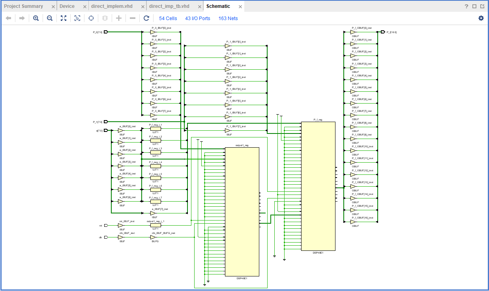 
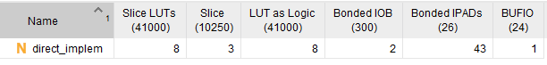  
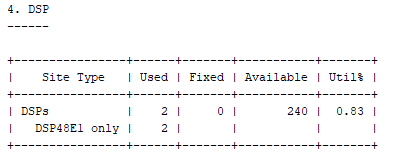  
### Results for Optimizing Design with DSP blocks to only use 1 DSP block
#### Implementation changing design from using 2 DSP blocks to 1
##### To get the design to only use 1 DSP block, the clock wizard from the IP catalog is used in order to generate a clock that is 2x the clock speed. The 2x clock will be used for the DSP block. (In this design: 40 MHz was used in order to 2x the clock to 80 MHz for the DSP block)
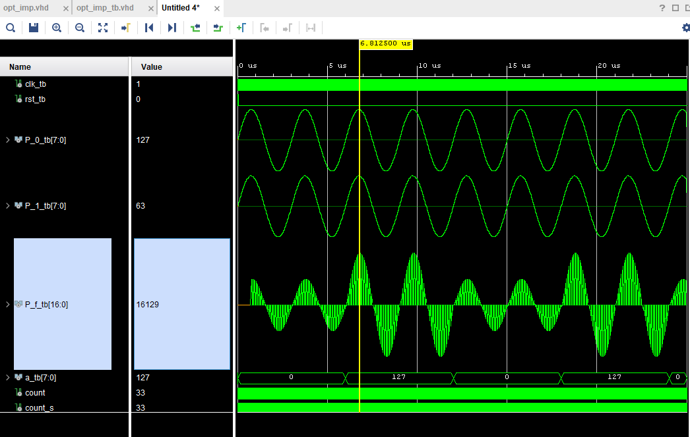  
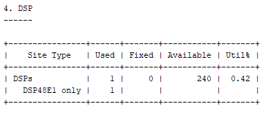  
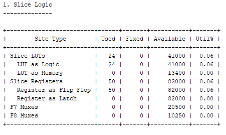  
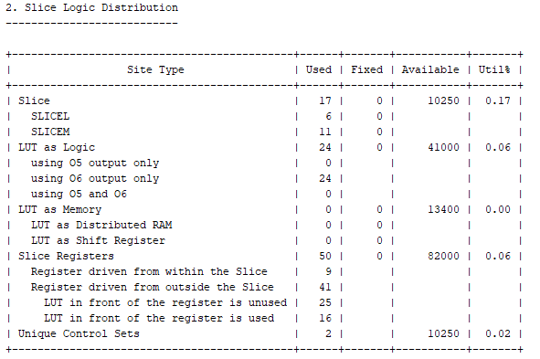  
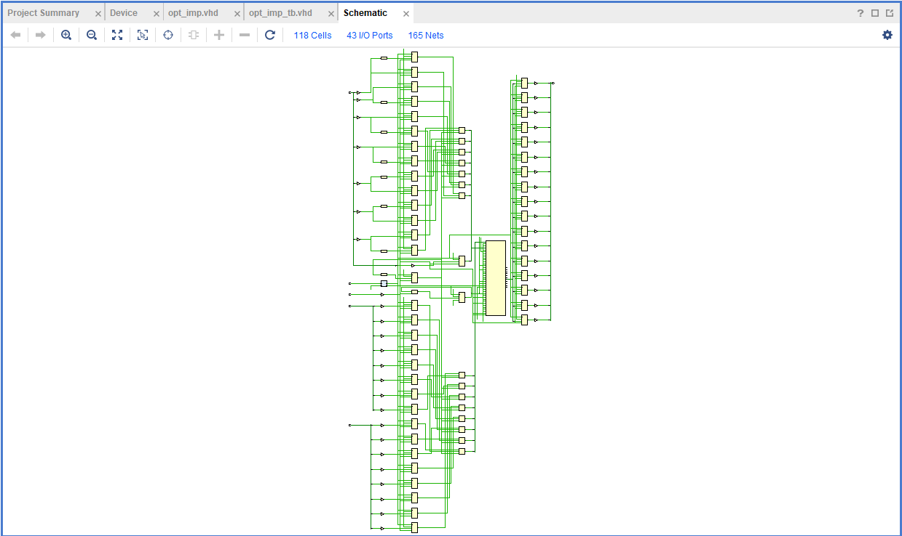  
### Results for Implementation of Optimized design when delaying an input using SRL components  
#### Synthesis and waveform for delayed design
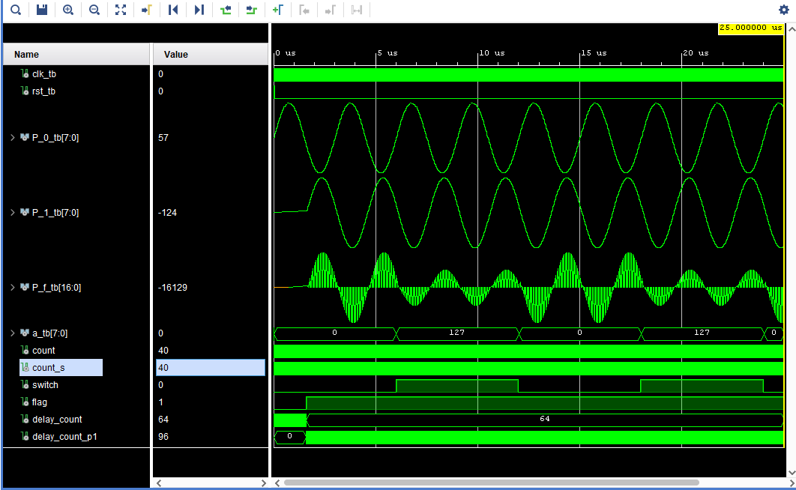  
![Delayed]](img/delayed_slice_logic.png)  
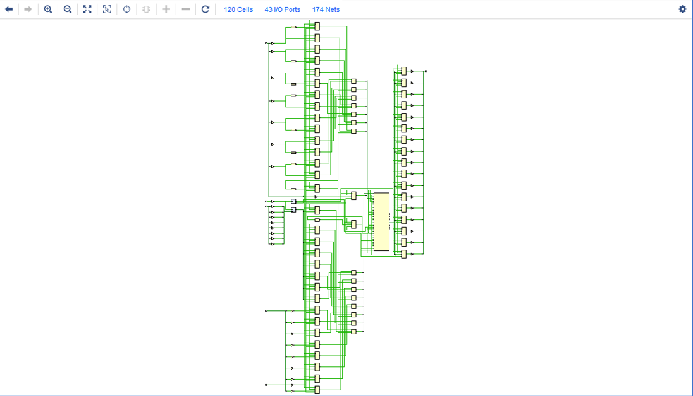  
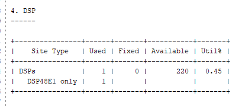  
